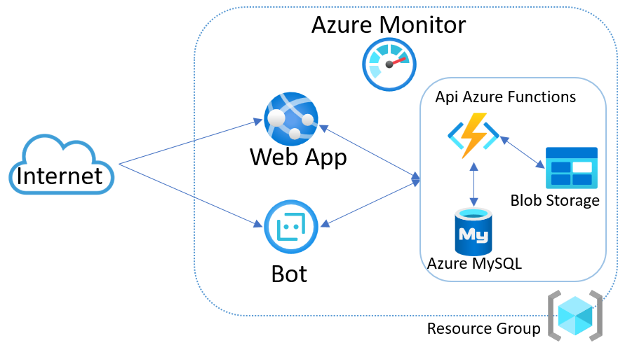

# hackaton

# ApoyaTec

### Descripción del Proyecto a Entregar (Corta)

### Link al Tiktok

### Diagrama de Azure

### SLA Compuesto
Dado los diferentes servicios, el SLA compuesto es de 99.68%

### TCO 3 años y Precio Total por mes
Se realizaron los calculos de servidores físicos con capacidades similares a los de la nube para realizar los calculos TCO

### Tiempo sin disponibilidad a un año

### Qué te pareció el evento
